# 基于区块链的药品溯源系统
# 技术栈
## 后端
- fisco
- solidity
- golang
- mysql
- gin
- gorm
## 前端
- vue3
- vite
- pinia
- vue-router
- element-plus
- unocss

# 功能
## 用户管理
### 用户基本信息
- id
- 用户名
- 密码
- 名称
- 角色 （生产商、经销商，用户）
- 状态 （启用 禁用）
- 注册时间
### 用户注册
> 填写 用户名 和密码 可选角色 生产商、经销商，用户， 注册状态默认为禁用
### 登陆
> 填写 账号 和密码
### 个人信息
- 修改密码
### 用户列表
> 管理员可看
> 展示当前系统的所有用户 
- 修改角色
- 修改状态

## 药品溯源

## 溯源
> 输入药品标识码进行溯源

## 药品列表
## 生产商添加商品
- 厂家名称
- 生产批次号
- 生产日期
- 有效期
- 药品成分
- 药品配方
- 质量控制和检验结果

## 生产商销售给经销商
- 选择经销商，进行销售
- 运输途径
- 运输条件
## 经销商保存药品
- 经销商名称
- 药品存储条件
- 药品存放地点
- 药品接受时间

## 销售
> 展示所有经销商的药品，用户购买
- 销售日期
- 购买者信息
### 订单列表
> 购买到的药品列表

基于区块链的药品溯源系统旨在通过区块链技术提高药品流通的透明度和安全性。该系统需要记录的药品信息包括但不限于以下几个关键方面：

1. **生产信息**：
   - 生产厂家和地点
   - 生产批次号
   - 生产日期和有效期
   - 药品的成分和配方
   - 质量控制和检验结果

2. **流通信息**：
   - 批发商和经销商信息
   - 运输途径和条件（如温度控制）
   - 药品的存储条件和地点
   - 药品的流通时间和路径

1. **销售信息**：
   - 销售点（如药房、医院）
   - 销售日期和数量
   - 购买者信息（可能需要匿名化处理以保护隐私）

前端普通用户可以查看药品基本信息和溯源信息，可以下订单购买药品

后台分管理员、生产商、经销商来提交药品的信息包括溯源信息
# 预览
<video controls src="http://localhost:33000/snowrain/fisco-drug-trace/raw/branch/main/assets/ecef0388f514dd60fca55ad0cc0ff341.mp4" title="Title"></video>
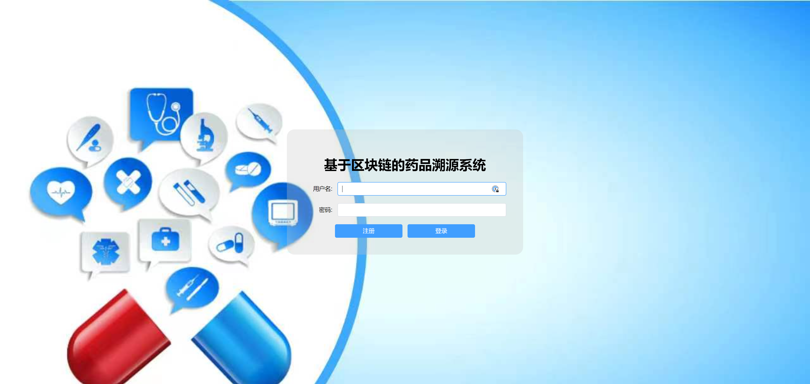
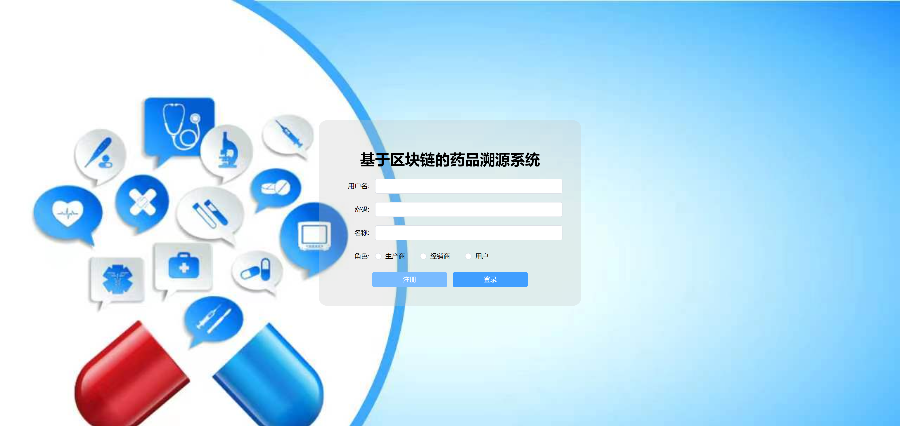
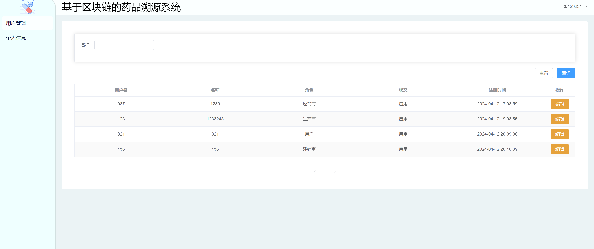
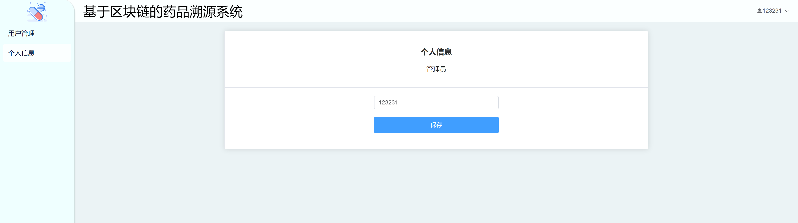
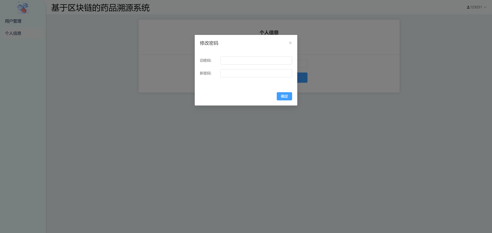
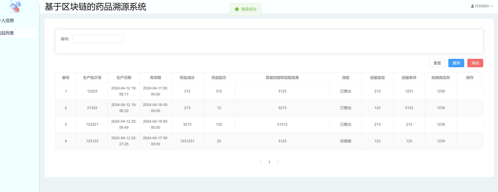
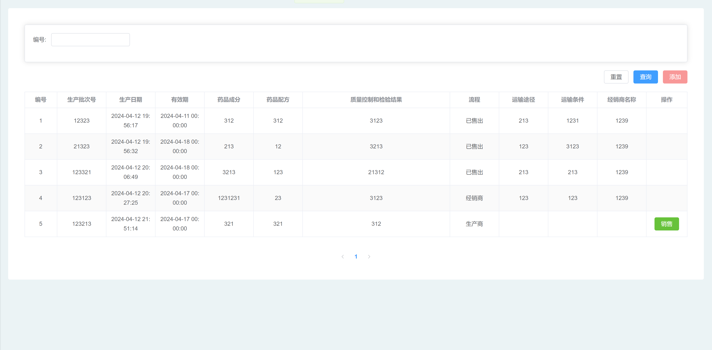
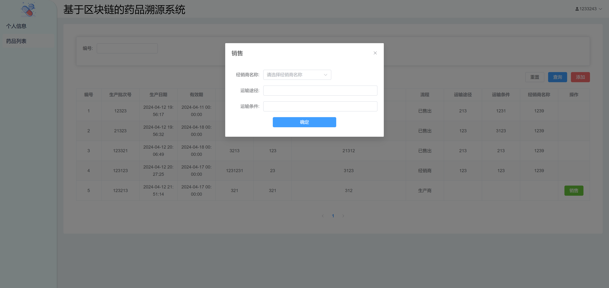
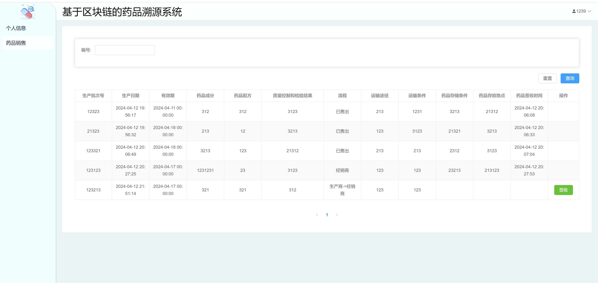
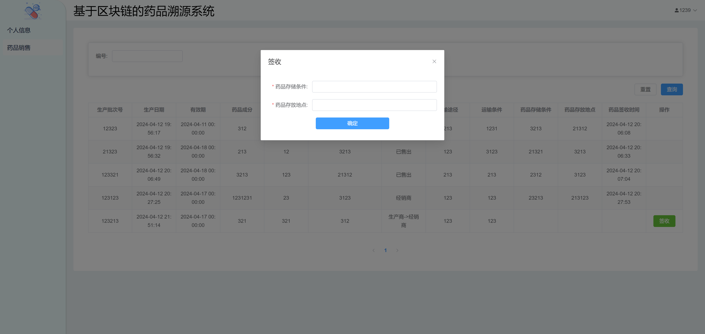
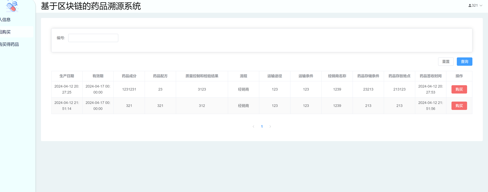
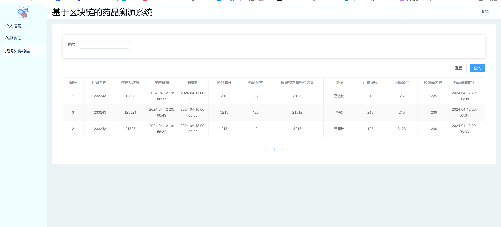